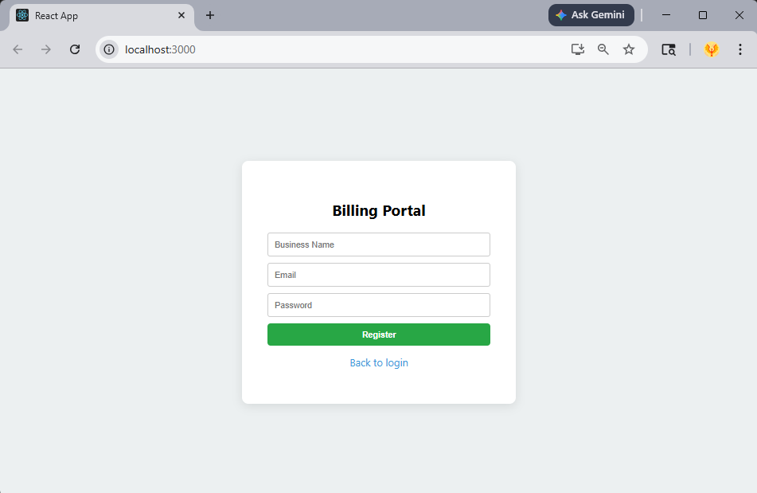
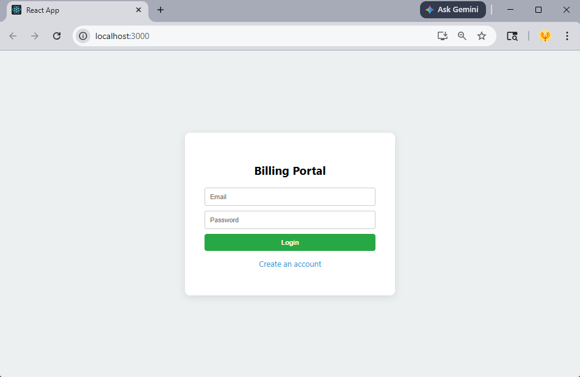
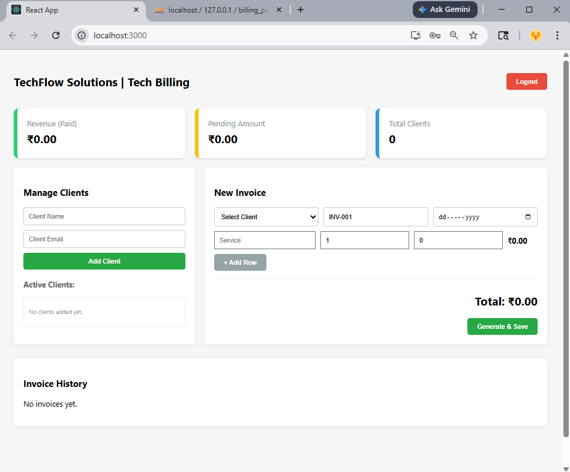
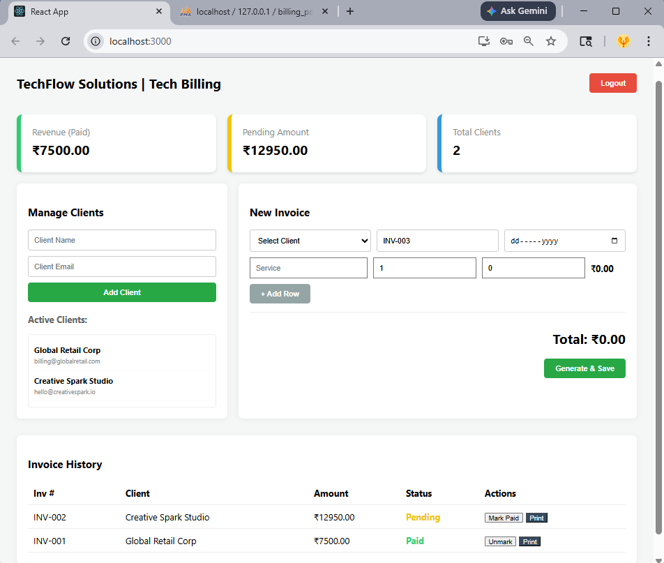
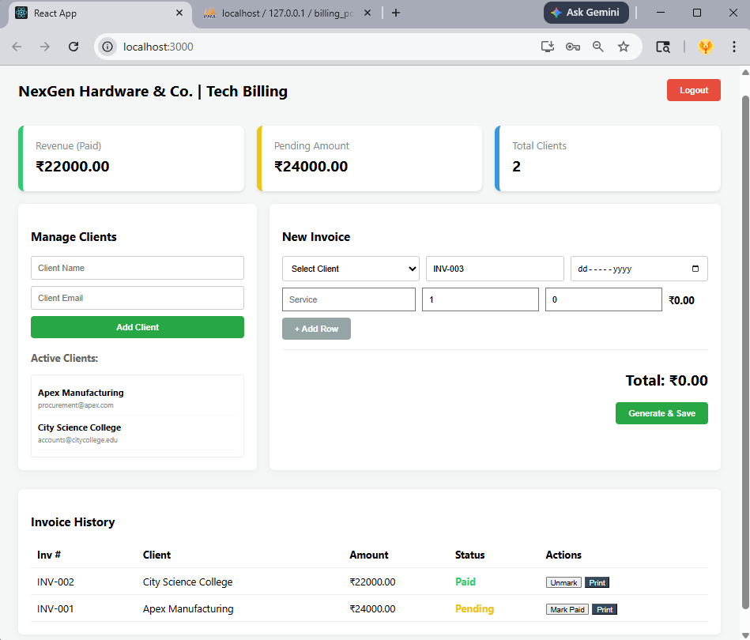

# Small Business Invoice & Billing Portal

A full-stack invoice and billing management system developed during internship using React.js, PHP, and MySQL. The project helps small businesses manage clients, generate invoices, track payments, and monitor billing activities through a responsive web interface.

---

## 🚀 Features

- Secure Login & Authentication
- Client Management
- Invoice Generation
- Payment Status Tracking
- Dashboard Analytics
- REST API Integration
- Responsive User Interface

---

## 🛠 Technologies Used

- React.js
- PHP
- MySQL
- Tailwind CSS
- Axios
- XAMPP

---

## 📂 Project Structure

```plaintext
billing_api/
public/
screenshots/
src/
README.md
billing_portal.sql
package.json
package-lock.json
```

---

## ⚙️ Installation & Setup

### 1. Install Required Software

- Node.js
- XAMPP
- VS Code (Recommended)

---

### 2. Clone the Repository

```bash
git clone https://github.com/your-username/your-repository-name.git
```

---

### 3. Setup Frontend

Open terminal in the project folder and run:

```bash
npm install
npm run dev
```

Frontend runs on:

```plaintext
http://localhost:5173
```

---

### 4. Setup Backend

Copy the `billing_api` folder into:

```plaintext
C:\xampp\htdocs\
```

Start Apache and MySQL from XAMPP.

---

### 5. Setup Database

- Open phpMyAdmin
- Create a database named:

```plaintext
billing_portal
```

- Import:

```plaintext
billing_portal.sql
```

---

### 6. Run the Project

Start the frontend using:

```bash
npm run dev
```

Open browser:

```plaintext
http://localhost:5173
```

---

## 🖼 Screenshots

### Registration Page


### Login Page


### Dashboard


### Invoice Management of 1st Company


### Invoice Management of 2nd Company



## 📌 Internship Major Project

Developed as part of internship training to gain practical experience in full-stack web application development using modern frontend and backend technologies.

---

## 👨‍💻 Author

Renuka
Electronics & Communication Engineering
